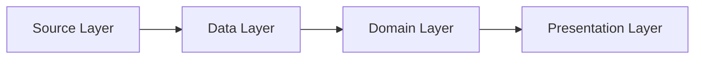

# ShinKu Architecture

ShinKu follows a modular "Clean Architecture" approach, dividing the application into layers to separate concerns and improve testability.

## Data Flow Overview

### 1. Source Layer (`source-api`, `source-local`)
- **Responsibility:** Communication with external websites and the local filesystem.
- **Key Components:** `CatalogueSource`, `HttpSource`, `SourceFactory`.
- **Note:** This layer is heavily restricted by the [Extension Freeze Zone](./extension-safeguards.md) to maintain APK compatibility.

### 2. Data Layer (`data`)
- **Responsibility:** Persistence and repository implementations.
- **Key Components:**
    - **SQLDelight:** Schema definitions (`.sq` files) and generated queries.
    - **Repositories:** Implementations of interfaces defined in the Domain layer (e.g., `MangaRepositoryImpl`).
    - **Backup:** Logic for exporting and restoring app state.

### 3. Domain Layer (`domain`)
- **Responsibility:** Business logic and high-level models.
- **Key Components:**
    - **Models:** Pure Kotlin data classes (e.g., `Manga`, `Chapter`).
    - **Interactors (Use Cases):** Single-purpose classes that perform a specific action (e.g., `GetManga`, `SyncTrack`).
    - **Repository Interfaces:** Definitions that the Data layer must implement.

### 4. Presentation Layer (`app`, `presentation-core`)
- **Responsibility:** UI and state management.
- **Key Components:**
    - **Voyager Screens:** Define the navigation nodes.
    - **ScreenModels:** Manage UI state and interact with Domain Interactors.
    - **Composables:** Jetpack Compose functions for rendering the UI.
    - **Themes:** Dynamic theming and visual styling.

## Dependency Injection
ShinKu uses **Injekt** for dependency management.
- Definitions are registered in `AppModule.kt`, `DataModule.kt`, and `DomainModule.kt`.
- Components are accessed via `Injekt.get()` or `injectLazy()`.

## Core Libraries
- **UI:** Jetpack Compose, Voyager (Navigation), Coil (Image Loading).
- **Persistence:** SQLDelight, DataStore.
- **Networking:** OkHttp, Retrofit (for some APIs).
- **Async:** Kotlin Coroutines & Flow.
